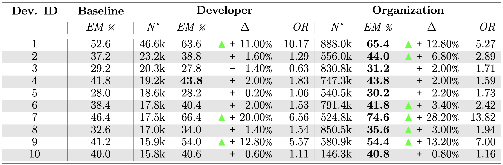

# [Replication Package] Why Personalizing Deep Learning-Based Code Completion Tools Matters

## Introduction
This repository contains the scripts required to reproduce the results described in *"Why Personalizing Deep Learning-Based Code Completion Tools Matters"*. 
In this work, we conduct an empirical study to understand how far it is possible to personalize code completion recommender systems on two levels of granularity: organization-specific and developer-specific.
We also provide additional details on the experiments reported in the paper (see [Additional results](#additional-results)).

## Contents 
1. [Prerequisites](#prerequisites)
2. [Datasets and materials](#datasets-and-materials)
3. [Replication of the results](#replication-of-the-results)
4. [Additional results](#additional-results)

## Prerequisites
Below is the list of the languages used for writing the scripts of this repository and the versions used for their execution:
- **Python** (tested on version 3.9.6)
- **R** (tested on version 4.3.2)
### Dependencies
Before running the scripts, you need to download some Python libraries. 
To avoid conflicts with packages installed locally on the machine, create a virtual environment as follows:
  ```sh
   python3 -m venv venv
   ```
and activate it:
  ```sh
   # on Linux / MacOS
   source venv/bin/activate

   # on Windows
   venv\Scripts\activate
   ```

Then, you can install all the required dependencies with the following command:  
   ```sh
   pip3 install -r requirements.txt
   ```
### Hardware 
We ran our experiments using a cluster consisting of 32 NVIDIA A40 and 8 NVIDIA A100 GPUs. You can replicate our work with different GPUs, setting the training configurations according to their capabilities  (see [Training](#training)).

To correctly reproduce the scripts for the model training, you need to install the CUDA toolkit version 12.2.0.

## Datasets and materials
You can find the datasets and the results of our experiments on our [Zenodo repository](https://doi.org/10.5281/zenodo.10817220).

Below, we describe the files stored in the repository:
- **datasets**: contains the datasets used for pre-training and fine-tuning our baseline (folder *general_datasets*) and for the second fine-tuning of developer- and organization-specific models (folder *developer_datasets*). 

    The datasets of the developers are organized as follows:
    - Train / validation / test set containing **developer code changes** ( files developer_masked_methods_\*.csv )
    - Train and validation sets used to train and validate the **organization-specific** model for that particular developer ( files apache_dataset_total_\*.csv )
    - Only for the top 10 developers, train and validation sets used to train and validate the **organization subset** (files apache_dataset_small_\*.csv) and the **baseline+** (files random_changes_\*.csv) models.
- **results**: contains the outcome of two experiments, namely the performance of the developer- and organization-specific models on the top 100 developers' test sets and the analysis of the impact of the training size. 

    In particular, we find the following folders:
    - **predictions_top_100_small**, which contains, for each developer, the predictions of the baseline model (folder *pt-sft1*) and of the developer- (folder *sft1-sft2-dev*) and organization-specific (folder *sft1-sft2-all-dev*) models on the developer test set. For the top 10 developers, you can also find the predictions of the organization subset model (folder *sft1-sft2-all-small*) and the baseline+ model (folder *rnd*).
    - **accuracies**, containing CSV files reporting the performance of each model on the developers' test sets.
    - **crystalBLEU**, containing the CrystalBLEU score on the predictions of each model. Further details on the distribution of the CrystalBLEU score are reported in the *crystalBLEU_distribution.txt* file.
    - **statistical_analysis**, containing the p-value and the Odds Ratio calculated on each model result (file pvalue_or_em_\*.csv) and the p-value and effect size on the CrystalBLEU distribution (file pvalue_es_cb_\*.csv).
- **additional-results**:  contains the outcome of the experiment conducted training T5 large on the top 10 developers. It is structured as the *results* folder. More details on these results are provided in [Additional results](#additional-results).

## Replication of the results
In this repository, you can find a list of numbered folders containing scripts for reproducing the results described in our work. To correctly execute the code, it is necessary to run the scripts step-by-step, starting from the first folder (*1-github-miner*). Each directory contains Bash scripts that aid the execution of the Python scripts following the correct flow. Note that some scripts require high computational resources to be correctly executed. Hence, we recommend running them on a high-performance machine.

### Datasets generation
The first step is creating the datasets for training our models. 

In the *1-github-miner* folder, we collect commits from developers of the Apache organization, targeting only Java repositories (*1.1-collect-commits*). After mining the relevant commits, we must run the notebook *dataset_analysis.ipynb* that remove noise from our dataset and apply the [gambit](https://github.com/gotec/gambit?tab=readme-ov-file) disambiguation tool to the authors' names and emails.

Then, in the 2-developer-datasets we proceed to get the first 1000 developers by the number of added lines and validate their aliases, extract methods containing developers' code changes from the collected commits, mask the affected lines / blocks and select the top 100 developers by the number of masked instances.

After creating the datasets of the developers, we can generate the pre-training and fine-tuning dataset for our baseline in folder *3-general-dataset*. We collect Java methods from the [codeparrot](https://huggingface.co/datasets/codeparrot/github-code) dataset, pre-process data, remove Apache methods, and mask the collected methods according to the distribution in the developer's dataset. 

Finally, we collect commits from repositories different from Apache and from those used in the training of the baseline (*1-github-miner/1.2-random-commits*) and generate the baseline+ dataset (*4-random-dataset*).

### Training
After producing the datasets, we can start pre-training and fine-tuning the baseline with [T5 small v1.1](https://huggingface.co/google/t5-v1_1-small) (*5-baseline-training*) and [T5 large v1.1](https://huggingface.co/google/t5-v1_1-large) (*6-baseline-training-large*). During the training of the models, we store checkpoints in a dedicated folder. We successively evaluate the best checkpoint on the validation set and pick it for the second fine-tuning step.

In *7-developer-training*, *8-size-impact-training*, and *9-large-training* folders, we reproduce the three experiments performing a second fine-tuning step on top of our base model. Before starting the training script, you must create the *general-models* directory, containing the selected checkpoint for the base model and the model tokenizer. Below is an example for the *7-developer-training* folder:
  ```sh
   # Move to the desired training folder
   cd 7-developer-training

   # Create the general-models directory
   mkdir general-models

   # Copy the base model checkpoint and the tokenizer folder
   cp -r ../5-baseline-training/fine-tuning/T5_Config ./general-models
   cp -r ../5-baseline-training/fine-tuning/checkpoints/checkpoint-10000 ./general-models/general-finetuned
   ```

We trained T5 small models with a batch size of 32 and T5 large models with a batch size of 4. Reproducing our work with different GPUs could require modifying this value to the most appropriate for the used machine. You can update this value by changing the variable "TRAIN_BATCH_SIZE" in the training scripts.

### Analysis of the results
Finally, the 10-results-analyses folder contains the code used for analyzing the outcome of the experiments. Starting from the datasets described above, you can reproduce the CrystalBLEU distribution and the statistical analyses reported in the paper. 

Below is an example of how to perform statistical tests and calculate CrystalBLEU distribution for T5 small and T5 large experiments: 

  ```sh
   # Move to the desired folder
   cd 10-results-analyses/statistical-analyses

   # Copy models' predictions of T5 small and large experiments
   cp -r ./<YOUR_PATH>/results/predictions_top_100_small .
   cp -r ./<YOUR_PATH>/additional-results/predictions_top_10_large .

   # Copy fine-tuning dataset for computing trivially shared n-grams
   cp ./<YOUR_PATH>/datasets/general_datasets/formatted_methods.csv .

   # Run script
   bash run_stats.sh
   ```
## Additional results

### Impact of the Training Data Size
In our work, we stated that the recorded boost in performance for developer- and organization-specific models is not only due to the additional amount of data.

To support the results of the exact match study, we calculated the CrystalBLEU score between the models' suggestions and the expected completions. The table below shows the distribution of the CrystalBLEU value on the developers' test sets for the considered models. In particular, we show the mean and median values and the first and third quartiles of the distribution.

|model  |              mean  |    median    | 1Q|     3Q|
|-------|--------------------|--------------|---|-------|              
baseline |              0.51 |    0.49   |      0.06  |  1.0|
developer   |           0.56  |   0.59   |      0.16  |  1.0|
organization subset  |  0.54  |   0.55   |      0.11  |  1.0|
organization    |       0.60  |   0.68   |      0.22  |  1.0|
baseline+  |        0.57  |   0.61   |      0.18  |  1.0 |

As a result, we found a higher semantic similarity for developer-specific models (mean=0.56, median=0.59) respect the suggestions provided by the organization subset (mean=0.54, median=0.55) and, similarly, a higher CrystalBLEU value for organization-specific models (mean=0.60, median=0.68) respect the
baseline+(mean=0.57, median=0.61). In both cases, the difference is statistically significant. Below are the results of the statistical tests:
- organization subset _versus_ developer-specific (p-value <0.001 and effect size=0.03) 
- baseline+ _versus_ organization-specific (p-value <0.001 and effect size=0.05)


### Impact of the Model Size
The table below describes the performance of developer- and organization-specific models trained on the top 10 developers' datasets using T5 large v1.1.



As mentioned in our work, we can see the same trend observed for the models trained with the smaller version of T5. Indeed, our baseline performs worse than developer- and organization-specific models, with the latter always being the best choice. In particular, in 6 developers out of 10, we observe a statistically significant increase in the performance of the organization-specific models.

The analysis of the CrystalBLEU distribution on the models' predictions further confirms this result:

model   |             mean  |  median |1Q  |  3Q |  
|-------|--------------------|--------------|---|-------|                                          
baseline |      0.59 | 0.65 |0.20  | 1.0 |
developer |     0.63 | 0.75 | 0.26 |  1.0 |
organization |   0.65 | 0.81 |  0.31 | 1.0 |

With a median CrystalBLEU value of 0.81, the organization-specific models provide more semantically similar recommendations than developer-specific models (median=0.75) and the baseline (median=0.65). The differences are statistically significant. Below, we list the results of the statistical tests:
- developer-specific _versus_ baseline (p-value <0.001 and effect size=0.06) 
- organization-specific _versus_ baseline (p-value <0.001 and effect size=0.09)
